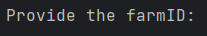
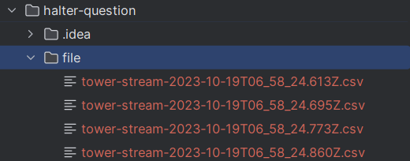

# halter-interview
### Question:  Takes in farm id as a parameter and returns the best tower for the given farm.

## Set Up
`pip install pandas` Then run the main.py

## Example

Input the farm id 

The result will be shown as above

## Note
* https://comms-tech-test.s3.ap-southeast-2.amazonaws.com/tower_stream/tower-stream-2023-10-19T06%3A58%3A24.657Z.csv
* https://comms-tech-test.s3.ap-southeast-2.amazonaws.com/tower_stream/tower-stream-2023-10-19T06%3A58%3A24.746Z.csv

I cannot get access the csv through these two links, if you want to test these two files, please download the csv file and put in the file folder

After that modify the code (line 16), copy and paste to replace line 16.

` df5 = pd.read_csv("./file/tower-stream-2023-10-19T06_58_24.657Z.csv")`
    
`df6 = pd.read_csv("./file/tower-stream-2023-10-19T06_58_24.746Z.csv")`

`data_frame = [df1, df2, df3, df4, df5, df6]`